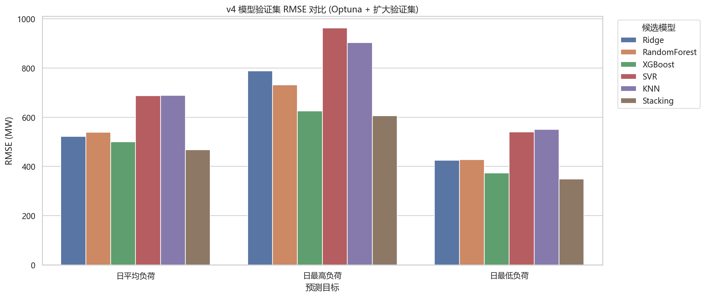
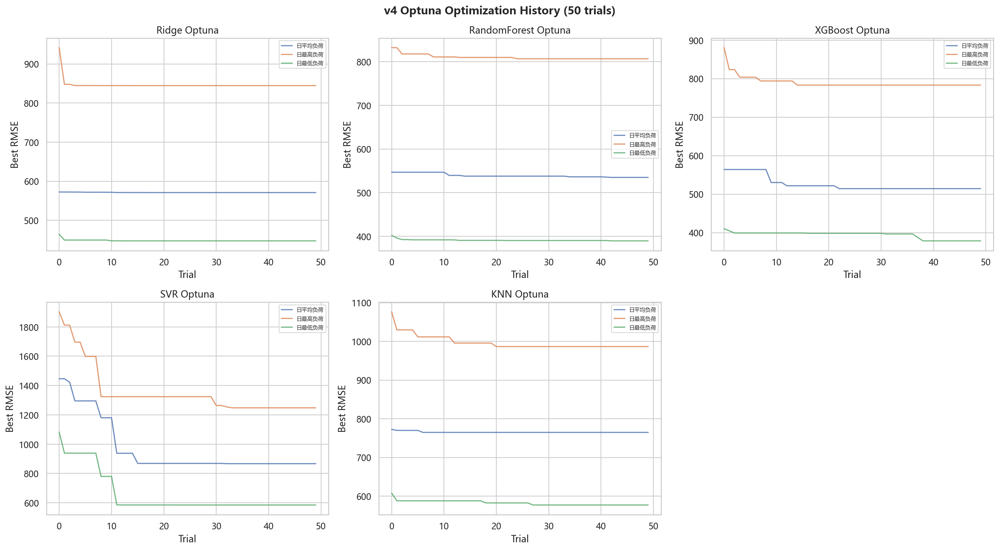
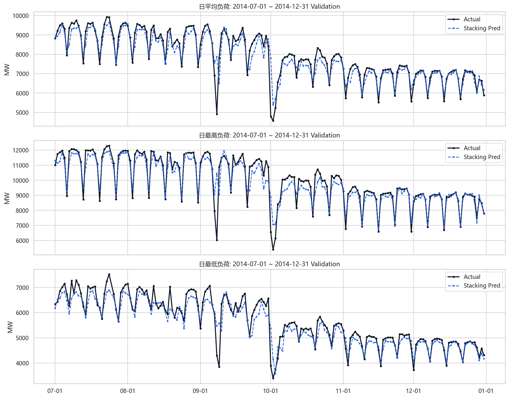
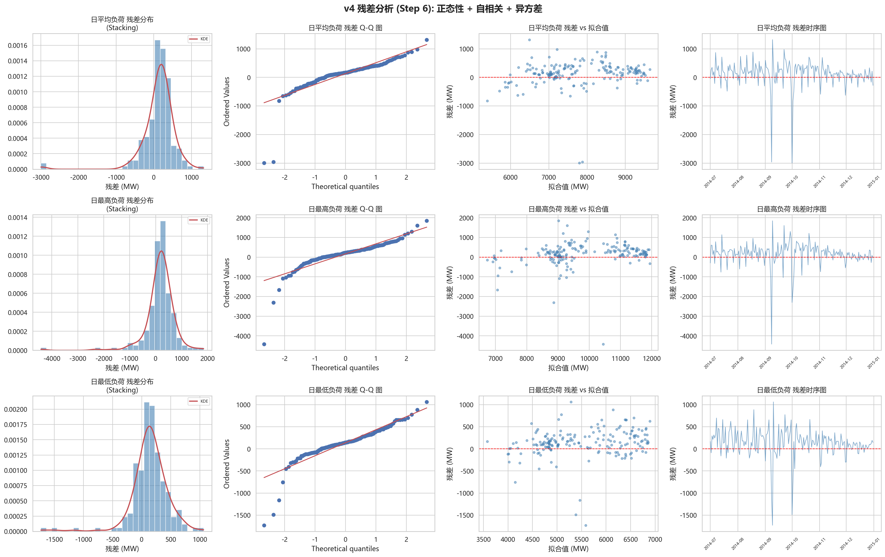
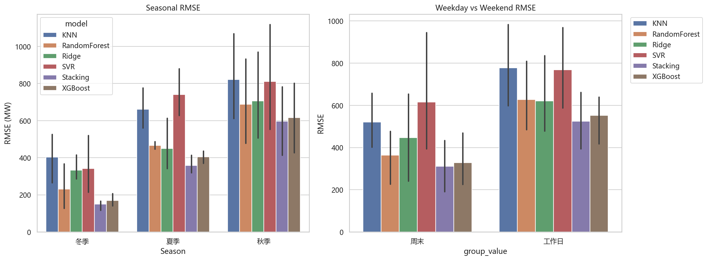
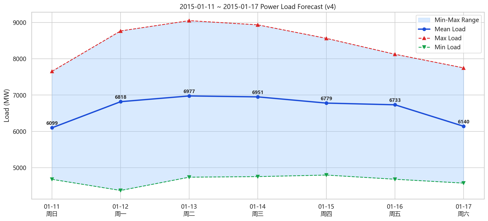

# 第二次汇报：模型训练、调参与预测结果

本次汇报承接第一次的数据处理与特征构建，不再重复讲清洗细节，重点展示模型如何训练、如何调参、如何验证，以及最终预测结果是否可信。

## 1. 建模任务与验证设计

- 任务：短期电力负荷多目标回归，分别预测日平均负荷、日最高负荷、日最低负荷。
- 训练期：2012-01-15 至 2014-06-30。
- 验证期：2014-07-01 至 2014-12-31，共 183 天。
- 验证方法：TimeSeriesSplit + 独立验证集，保证时间顺序不被打乱。
- 安全策略：本报告只读取已有结果，不重复运行 Optuna 和 Stacking 训练。

## 2. 训练流程

训练主线是：特征矩阵准备 -> 五类基模型调参 -> Stacking 集成 -> 验证集评估 -> 统计检验 -> 残差诊断 -> 7 天递推预测。

## 3. 候选模型与集成策略

| 角色 | 模型 | 函数/结构 | 学习策略 | 使用理由 |
| --- | --- | --- | --- | --- |
| a | Ridge | Ridge: Ridge Regression | Linear + L2 Regularization | Interpretable linear baseline |
| b | RandomForest | RandomForestRegressor | Bagging: parallel tree averaging | Robust to non-linearity and outliers |
| c | XGBoost | XGBRegressor (CUDA) | Boosting: sequential residual fitting | Complex non-linear pattern capture |
| d | SVR | SVR (RBF kernel) | Kernel method: epsilon-insensitive hyperplane | Complementary to tree models |
| e | KNN | K-Nearest Neighbors | Distance-based similar day matching | Non-parametric similarity-based |
| a+b+c+d+e | Stacking | StackingRegressor: 5 base + Ridge meta | Meta-learner learns optimal combination | Maximize ensemble diversity |

## 4. Optuna 调参过程

每个目标和每个基模型执行 50 次 trial，共 750 条调参记录。调参目标是最小化 TimeSeriesSplit RMSE。

| 目标 | 模型 | trials | 最佳trial | 最佳CV RMSE | 核心参数 |
| --- | --- | --- | --- | --- | --- |
| 日平均负荷 | XGBoost | 50 | 22 | 514.35 | n_estimators=565, max_depth=11, learning_rate=0.02828, subsample=0.8762, colsample_bytree=0.9995, min_child_weight=7, reg_alpha=0.0001651, reg_lambda=0.0001114 |
| 日平均负荷 | RandomForest | 50 | 42 | 534.88 | n_estimators=162, max_depth=16, min_samples_leaf=2, min_samples_split=4 |
| 日平均负荷 | Ridge | 50 | 38 | 570.92 | alpha=1.035 |
| 日平均负荷 | KNN | 50 | 6 | 764.71 | n_neighbors=7, weights=distance |
| 日平均负荷 | SVR | 50 | 32 | 866.97 | C=96.59, gamma=0.02909, epsilon=0.158 |
| 日最低负荷 | XGBoost | 50 | 38 | 378.65 | n_estimators=135, max_depth=3, learning_rate=0.1683, subsample=0.9092, colsample_bytree=0.6345, min_child_weight=2, reg_alpha=0.06343, reg_lambda=0.09233 |
| 日最低负荷 | RandomForest | 50 | 42 | 389.54 | n_estimators=420, max_depth=18, min_samples_leaf=4, min_samples_split=11 |
| 日最低负荷 | Ridge | 50 | 31 | 447.44 | alpha=2.769 |
| 日最低负荷 | KNN | 50 | 27 | 577.11 | n_neighbors=5, weights=distance |
| 日最低负荷 | SVR | 50 | 23 | 585.24 | C=99.46, gamma=0.01857, epsilon=0.1264 |
| 日最高负荷 | XGBoost | 50 | 14 | 783.26 | n_estimators=473, max_depth=5, learning_rate=0.0593, subsample=0.7072, colsample_bytree=0.9142, min_child_weight=4, reg_alpha=1.585e-05, reg_lambda=0.001826 |
| 日最高负荷 | RandomForest | 50 | 24 | 806.63 | n_estimators=164, max_depth=21, min_samples_leaf=1, min_samples_split=2 |
| 日最高负荷 | Ridge | 50 | 40 | 844.47 | alpha=1.37 |
| 日最高负荷 | KNN | 50 | 20 | 986.64 | n_neighbors=5, weights=distance |
| 日最高负荷 | SVR | 50 | 33 | 1248.07 | C=76.32, gamma=0.01189, epsilon=0.3306 |

## 5. 训练日志

| 目标 | 模型 | 训练期 | 验证期 | 特征数 | 训练秒数 | CV各折RMSE |
| --- | --- | --- | --- | --- | --- | --- |
| 日平均负荷 | Ridge | 2012-01-15 至 2014-06-30 | 2014-07-01 至 2014-12-31 | 22 | 0.003 | 544.7, 498.7, 575.6 |
| 日平均负荷 | RandomForest | 2012-01-15 至 2014-06-30 | 2014-07-01 至 2014-12-31 | 22 | 0.902 | 542.5, 486.7, 633.9 |
| 日平均负荷 | XGBoost | 2012-01-15 至 2014-06-30 | 2014-07-01 至 2014-12-31 | 22 | 2.933 | 589.1, 463.4, 596.2 |
| 日平均负荷 | SVR | 2012-01-15 至 2014-06-30 | 2014-07-01 至 2014-12-31 | 22 | 0.029 | 936.6, 837.9, 738.2 |
| 日平均负荷 | KNN | 2012-01-15 至 2014-06-30 | 2014-07-01 至 2014-12-31 | 22 | 0.002 | 783.3, 613.9, 715.4 |
| 日平均负荷 | Stacking | 2012-01-15 至 2014-06-30 | 2014-07-01 至 2014-12-31 | 22 | 14.279 | 494.4, 434.7, 537.8 |
| 日最高负荷 | Ridge | 2012-01-15 至 2014-06-30 | 2014-07-01 至 2014-12-31 | 22 | 0.009 | 827.3, 738.1, 856.0 |
| 日最高负荷 | RandomForest | 2012-01-15 至 2014-06-30 | 2014-07-01 至 2014-12-31 | 22 | 1.080 | 841.7, 718.1, 860.3 |
| 日最高负荷 | XGBoost | 2012-01-15 至 2014-06-30 | 2014-07-01 至 2014-12-31 | 22 | 1.177 | 1025.3, 660.1, 795.0 |
| 日最高负荷 | SVR | 2012-01-15 至 2014-06-30 | 2014-07-01 至 2014-12-31 | 22 | 0.027 | 1317.1, 1238.3, 1017.0 |
| 日最高负荷 | KNN | 2012-01-15 至 2014-06-30 | 2014-07-01 至 2014-12-31 | 22 | 0.002 | 1021.0, 784.1, 928.8 |
| 日最高负荷 | Stacking | 2012-01-15 至 2014-06-30 | 2014-07-01 至 2014-12-31 | 22 | 8.558 | 764.9, 598.4, 737.9 |
| 日最低负荷 | Ridge | 2012-01-15 至 2014-06-30 | 2014-07-01 至 2014-12-31 | 22 | 0.012 | 431.2, 411.1, 440.5 |
| 日最低负荷 | RandomForest | 2012-01-15 至 2014-06-30 | 2014-07-01 至 2014-12-31 | 22 | 1.795 | 416.6, 332.9, 459.2 |
| 日最低负荷 | XGBoost | 2012-01-15 至 2014-06-30 | 2014-07-01 至 2014-12-31 | 22 | 0.420 | 463.0, 311.0, 410.2 |
| 日最低负荷 | SVR | 2012-01-15 至 2014-06-30 | 2014-07-01 至 2014-12-31 | 22 | 0.024 | 634.6, 544.5, 580.0 |
| 日最低负荷 | KNN | 2012-01-15 至 2014-06-30 | 2014-07-01 至 2014-12-31 | 22 | 0.002 | 606.7, 448.7, 561.4 |
| 日最低负荷 | Stacking | 2012-01-15 至 2014-06-30 | 2014-07-01 至 2014-12-31 | 22 | 6.808 | 446.0, 313.6, 379.3 |

## 6. 验证集表现与最终选型

三个目标最终都选择 Stacking。它相比次优 XGBoost 仍有 3%-7% 的 RMSE 改善。

| 目标 | 最终模型 | 验证RMSE | MAE | MAPE(%) | R2 | 次优模型 | 较次优RMSE降低(%) | CV RMSE | 泛化风险 |
| --- | --- | --- | --- | --- | --- | --- | --- | --- | --- |
| 日平均负荷 | Stacking | 467.33 | 310.59 | 4.229 | 0.8482 | XGBoost | 6.63 | 488.97 | 低风险 |
| 日最高负荷 | Stacking | 605.54 | 396.07 | 4.267 | 0.8497 | XGBoost | 3.11 | 700.37 | 低风险 |
| 日最低负荷 | Stacking | 348.43 | 248.05 | 4.483 | 0.8660 | XGBoost | 6.67 | 379.62 | 低风险 |

## 7. 统计检验

配对 T 检验关注误差均值差异，DM 检验关注时序预测能力差异。p >= 0.05 不代表两个模型一样好，只代表当前样本下证据不足。

| 目标 | 比较 | 配对T p值 | DM p值 | 结论 |
| --- | --- | --- | --- | --- |
| 日平均负荷 | Stacking vs XGBoost | 0.000006 | 0.000216 | 预测能力差异显著 |
| 日最高负荷 | Stacking vs XGBoost | 0.001394 | 0.258019 | RMSE更优，DM未达显著 |
| 日最低负荷 | Stacking vs XGBoost | 0.000002 | 0.070126 | RMSE更优，DM未达显著 |

## 8. 业务命中率

PAC@5% 表示相对误差不超过 5% 的天数比例，比单纯 RMSE 更容易解释给业务方。

| 目标 | 最佳模型 | PAC@5% | 命中天数 | 业务解释 |
| --- | --- | --- | --- | --- |
| 日平均负荷 | Stacking | 0.7541 | 138/183 | 相对误差不超过5%的验证日比例 |
| 日最低负荷 | Stacking | 0.7158 | 131/183 | 相对误差不超过5%的验证日比例 |
| 日最高负荷 | Stacking | 0.7541 | 138/183 | 相对误差不超过5%的验证日比例 |

## 9. 残差与稳定性检查

残差诊断用于确认模型不是只在指标上好看。日最低负荷 lag=1 残差存在显著自相关，后续可加入节后恢复和夜间负荷变化特征继续优化。

| 目标 | 模型 | 残差均值 | 残差标准差 | 正态性 | Ljung-Box | Breusch-Pagan |
| --- | --- | --- | --- | --- | --- | --- |
| 日平均负荷 | Stacking | 132.3338 | 448.2050 | 拒绝正态假设 | lag1 p=0.1008; lag7 p=0.6478; lag14 p=0.7787 | p=0.9997 |
| 日最高负荷 | Stacking | 166.7044 | 582.1369 | 拒绝正态假设 | lag1 p=0.6391; lag7 p=0.7923; lag14 p=0.9390 | p=0.7519 |
| 日最低负荷 | Stacking | 138.0051 | 319.9292 | 拒绝正态假设 | lag1 p=0.0371; lag7 p=0.0776; lag14 p=0.2029 | p=0.9674 |

## 10. 分季节结果

分季节评估可以检查模型是否只在某一段时间表现好。验证期内秋季波动较大，是主要误差来源。

| 目标 | 季节 | 样本数 | RMSE | MAE | MAPE(%) |
| --- | --- | --- | --- | --- | --- |
| 日平均负荷 | 冬季 | 31 | 165.05 | 135.79 | 2.073 |
| 日平均负荷 | 夏季 | 61 | 342.74 | 278.2 | 3.1 |
| 日平均负荷 | 秋季 | 91 | 592.6 | 391.86 | 5.72 |
| 日最低负荷 | 冬季 | 31 | 117.61 | 98.06 | 2.145 |
| 日最低负荷 | 夏季 | 61 | 319.22 | 255.66 | 3.781 |
| 日最低负荷 | 秋季 | 91 | 413.66 | 294.04 | 5.749 |
| 日最高负荷 | 冬季 | 31 | 166.37 | 129.42 | 1.524 |
| 日最高负荷 | 夏季 | 61 | 413.69 | 342.71 | 3.11 |
| 日最高负荷 | 秋季 | 91 | 783.09 | 522.69 | 5.976 |

## 11. 最终预测

最终预测采用三个 Stacking 模型，并做物理约束校验：日最低 <= 日平均 <= 日最高，且所有预测负荷 > 0。

| 日期 | 星期 | 预测日平均(MW) | 预测日最高(MW) | 预测日最低(MW) | 均值模型 | 最高模型 | 最低模型 |
| --- | --- | --- | --- | --- | --- | --- | --- |
| 2015-01-11 | 周日 | 6098.66 | 7656.09 | 4677.13 | Stacking | Stacking | Stacking |
| 2015-01-12 | 周一 | 6818.49 | 8769.07 | 4370.3 | Stacking | Stacking | Stacking |
| 2015-01-13 | 周二 | 6976.9 | 9053.26 | 4736.46 | Stacking | Stacking | Stacking |
| 2015-01-14 | 周三 | 6951.04 | 8936.76 | 4752.16 | Stacking | Stacking | Stacking |
| 2015-01-15 | 周四 | 6779.48 | 8564.29 | 4795.06 | Stacking | Stacking | Stacking |
| 2015-01-16 | 周五 | 6732.51 | 8125.81 | 4679.48 | Stacking | Stacking | Stacking |
| 2015-01-17 | 周六 | 6140.12 | 7750.08 | 4572.96 | Stacking | Stacking | Stacking |

## 12. 汇报结论

1. 数据处理后构造了 22 个建模特征，包含气象、周期、滞后和滚动统计。
2. XGBoost 是最强基模型，但 Stacking 进一步提升了三个目标的验证集 RMSE。
3. 日平均负荷的 Stacking 相比 XGBoost 在 DM 检验下达到显著提升；日最高和日最低负荷 RMSE 更优，但 DM 未达显著，需要如实汇报。
4. 最终 7 天预测满足物理约束，可以作为项目二的最终提交结果。
