# 第一次汇报：数据处理与特征构建

本次汇报只覆盖项目二的数据处理部分，不展开模型训练。

## 1. 原始数据

- `Area_Load`：每天一行，96 个 15 分钟负荷采样点。
- `Area_Weather`：每天一行，包含最高温、最低温、平均温、湿度、降雨量。
- 预测目标期：`2015-01-11` 至 `2015-01-17`。

| 检查项 | 结果 | 说明 |
| --- | --- | --- |
| Area_Load 原始负荷表 | 2208 行 x 97 列 | 每天一行，96 个 15 分钟采样点。 |
| Area_Weather 原始天气表 | 1113 行 x 6 列 | 每天一行，包含最高/最低/平均温度、湿度、降雨量。 |
| 负荷采样列数 | 96 个 | 96 = 24 小时 x 每小时 4 个 15 分钟点。 |
| 预测目标期负荷缺失 | 672 个单元格 | 正好 7 天 x 96 点，是题目要求预测的目标，不作为异常删除。 |
| 目标期天气是否完整 | 0 个缺失 | 递推预测时可以使用目标期已给定天气。 |
| 建模日粒度表 | 2208 行 x 23 列 | 由 15 分钟负荷聚合为日最大、日最小、日平均。 |
| IQR 检测字段数 | 6 个 | 对负荷目标和主要天气变量做异常值检测。 |
| IQR 极端候选处理方式 | 保留原值并增加标记 | 极端天气/负荷有研究价值，不直接删除或截尾。 |
| 特征参考权重字段数 | 66 个 | 按目标变量分别计算解释性权重。 |

## 2. 数据处理流程

1. 读取 Excel 的两个工作表。
2. 将负荷宽表通过 `melt` 转成长表。
3. 按日期聚合为 `load_max`、`load_min`、`load_mean`。
4. 按 `YMD` 合并天气数据。
5. 构造天气、日历、周期、滞后和滚动特征。

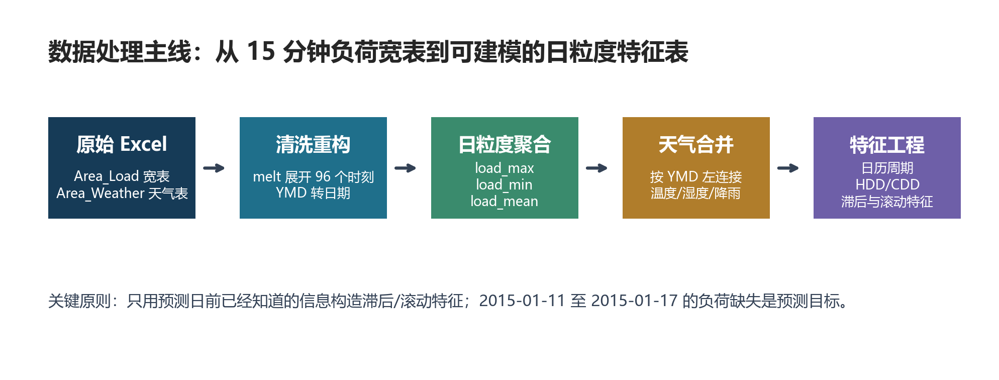

## 3. 天气合并与衍生变量的来源

天气特征来自业务联想和数据验证：高温会带来制冷负荷，低温会带来供热/取暖负荷，温差会影响一天内负荷波动。因此先按 `YMD` 将天气表合并到日负荷表，再构造 `temp_range`、`hdd`、`cdd`。

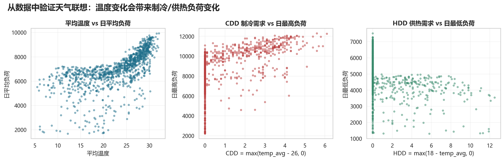

关键公式：

- `temp_range = temp_max - temp_min`
- `hdd = max(18 - temp_avg, 0)`
- `cdd = max(temp_avg - 26, 0)`

## 4. 核心代码：读取与日粒度聚合

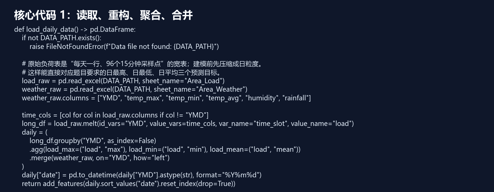

```python
def load_daily_data() -> pd.DataFrame:
    if not DATA_PATH.exists():
        raise FileNotFoundError(f"Data file not found: {DATA_PATH}")

    # 原始负荷表是“每天一行、96个15分钟采样点”的宽表；建模前先压缩成日粒度。
    # 这样能直接对应题目要求的日最高、日最低、日平均三个预测目标。
    load_raw = pd.read_excel(DATA_PATH, sheet_name="Area_Load")
    weather_raw = pd.read_excel(DATA_PATH, sheet_name="Area_Weather")
    weather_raw.columns = ["YMD", "temp_max", "temp_min", "temp_avg", "humidity", "rainfall"]

    time_cols = [col for col in load_raw.columns if col != "YMD"]
    long_df = load_raw.melt(id_vars="YMD", value_vars=time_cols, var_name="time_slot", value_name="load")
    daily = (
        long_df.groupby("YMD", as_index=False)
        .agg(load_max=("load", "max"), load_min=("load", "min"), load_mean=("load", "mean"))
        .merge(weather_raw, on="YMD", how="left")
    )
    daily["date"] = pd.to_datetime(daily["YMD"].astype(str), format="%Y%m%d")
    return add_features(daily.sort_values("date").reset_index(drop=True))
```

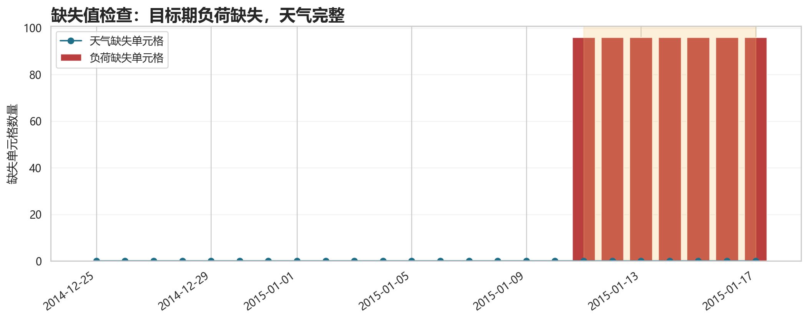

## 5. 数据分布、极端值识别与质量检查

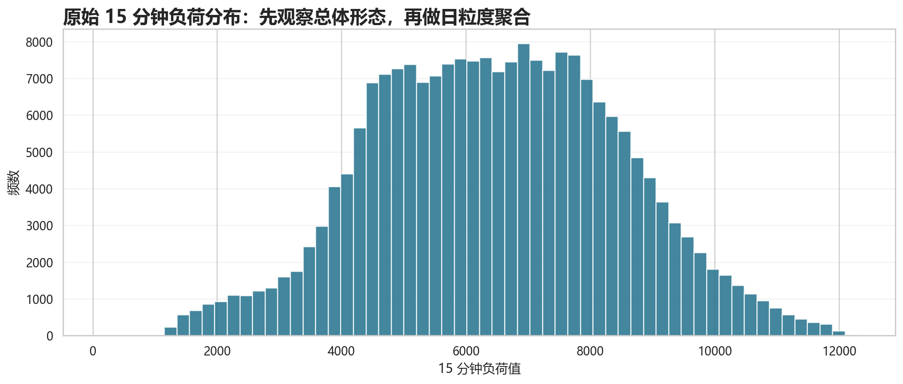

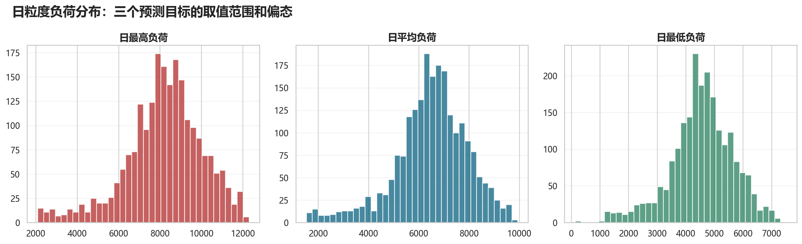

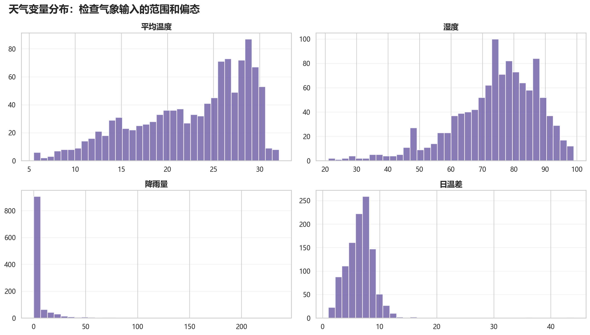

IQR 规则用于识别统计极端候选值，但这些值不一定是错误。极端天气和极端负荷具有研究价值，因此本项目保留原始值并增加极端事件标记。

真正需要修正的是物理不可能值：

| 检查对象 | 规则 | 问题数量 | 处理结论 |
| --- | --- | --- | --- |
| 15 分钟负荷 | 负荷应大于 0 | 0 | 若出现才视为错误；当前不需要修正 |
| 湿度 | 0 <= humidity <= 100 | 0 | 越界才视为错误；当前不需要修正 |
| 降雨量 | rainfall >= 0 | 0 | 负降雨才视为错误；当前不需要修正 |
| 温度关系 | temp_min <= temp_avg <= temp_max | 0 | 关系不成立才视为错误；当前不需要修正 |

| 字段 | 中文含义 | Q1 | Q3 | IQR | 下界 | 上界 | 极端候选数量 | 极端占比(%) | 业务解释 | 处理策略 |
| --- | --- | --- | --- | --- | --- | --- | --- | --- | --- | --- |
| load_max | 日最高负荷 | 7172.215936 | 9383.877856 | 2211.6619199999996 | 3854.7230560000003 | 12701.370735999999 | 72 | 3.27 | 可能是极端天气、节假日或生产活动变化导致 | 保留原始值，增加极端事件标记，不作为错误删除 |
| load_min | 日最低负荷 | 3953.457568 | 5253.797536 | 1300.3399680000002 | 2002.9476159999995 | 7204.307488 | 61 | 2.77 | 可能是极端天气、节假日或生产活动变化导致 | 保留原始值，增加极端事件标记，不作为错误删除 |
| load_mean | 日平均负荷 | 5734.891411 | 7417.454063 | 1682.5626520000005 | 3211.047432999999 | 9941.298041000002 | 79 | 3.59 | 可能是极端天气、节假日或生产活动变化导致 | 保留原始值，增加极端事件标记，不作为错误删除 |
| temp_avg | 平均温度 | 18.2 | 27.9 | 9.7 | 3.6500000000000004 | 42.449999999999996 | 0 | 0.0 | 可能是极端天气、节假日或生产活动变化导致 | 保留原始值，增加极端事件标记，不作为错误删除 |
| humidity | 相对湿度 | 67.0 | 84.0 | 17.0 | 41.5 | 109.5 | 28 | 2.53 | 可能是极端天气、节假日或生产活动变化导致 | 保留原始值，增加极端事件标记，不作为错误删除 |
| rainfall | 降雨量 | 0.0 | 2.8 | 2.8 | -4.199999999999999 | 6.999999999999999 | 195 | 17.66 | 可能是极端天气、节假日或生产活动变化导致 | 保留原始值，增加极端事件标记，不作为错误删除 |

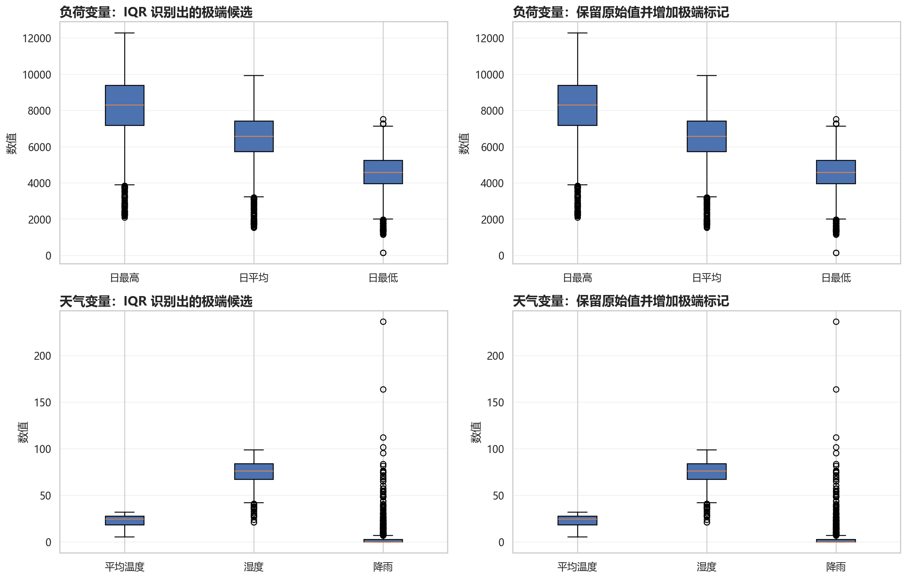

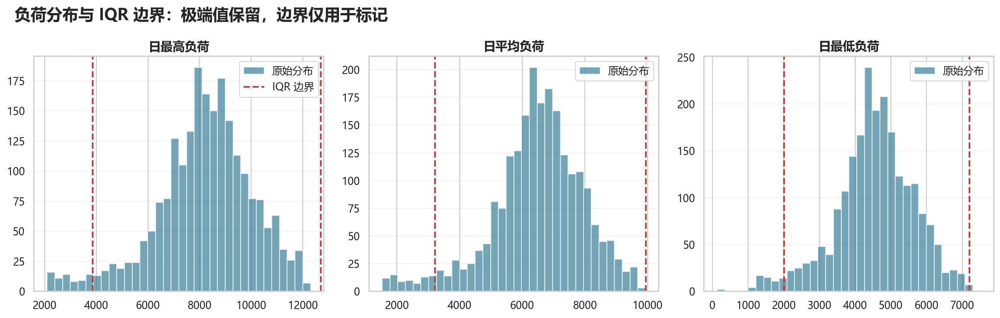

```python
def detect_outliers_iqr(df: pd.DataFrame, columns: list[str]) -> pd.DataFrame:
"""使用 IQR 四分位距规则识别“极端候选值”，对应 HTML 第 6 节。

注意：IQR 标出来的是统计意义上的极端值，不等于错误数据。
对电力负荷预测来说，极端天气和极端负荷反而很有研究价值，
所以这里的策略是“识别并标记”，不是直接删除或截尾。
"""
# 只用已知历史期计算异常边界，不能把 2015-01-11 之后的预测目标期混进去。
known = df[df["date"] <= pd.Timestamp("2015-01-10")].copy()
rows: list[dict[str, object]] = []
for col in columns:
    values = known[col].dropna()
    # Q1/Q3 是 25% 和 75% 分位数；IQR = Q3 - Q1。
    q1 = float(values.quantile(0.25))
    q3 = float(values.quantile(0.75))
    iqr = q3 - q1
    # 经典箱线图异常值边界：低于 Q1-1.5IQR 或高于 Q3+1.5IQR。
    lower = q1 - 1.5 * iqr
    upper = q3 + 1.5 * iqr
    flags = (values < lower) | (values > upper)
    rows.append(
        {
            "字段": col,
            "中文含义": feature_label(col),
            "Q1": q1,
            "Q3": q3,
            "IQR": iqr,
            "下界": lower,
            "上界": upper,
            "极端候选数量": int(flags.sum()),
            "极端占比(%)": round(float(flags.mean() * 100), 2),
            "业务解释": "可能是极端天气、节假日或生产活动变化导致",
            "处理策略": "保留原始值，增加极端事件标记，不作为错误删除",
        }
    )
return pd.DataFrame(rows)


    def add_extreme_event_flags(df: pd.DataFrame, outlier_summary: pd.DataFrame) -> pd.DataFrame:
"""根据 IQR 边界增加极端事件标记，但不改变原始数值。"""
cleaned = df.copy()
for _, row in outlier_summary.iterrows():
    col = str(row["字段"])
    lower = float(row["下界"])
    upper = float(row["上界"])
    # 标记字段用于解释和后续建模扩展；原始负荷/天气值全部保留。
    cleaned[f"{col}_extreme_flag"] = ((cleaned[col] < lower) | (cleaned[col] > upper)).astype(int)
return cleaned


    def physical_quality_checks(load_raw: pd.DataFrame, daily: pd.DataFrame) -> pd.DataFrame:
"""检查真正需要修正的物理不可能值，例如负负荷、湿度越界。"""
time_cols = [c for c in load_raw.columns if c != "YMD"]
known_load = load_raw[load_raw["YMD"] <= 20150110][time_cols]
rows = [
    {
        "检查对象": "15 分钟负荷",
        "规则": "负荷应大于 0",
        "问题数量": int((known_load <= 0).sum().sum()),
        "处理结论": "若出现才视为错误；当前不需要修正",
    },
    {
        "检查对象": "湿度",
        "规则": "0 <= humidity <= 100",
        "问题数量": int(((daily["humidity"] < 0) | (daily["humidity"] > 100)).sum()),
        "处理结论": "越界才视为错误；当前不需要修正",
    },
    {
        "检查对象": "降雨量",
        "规则": "rainfall >= 0",
        "问题数量": int((daily["rainfall"] < 0).sum()),
        "处理结论": "负降雨才视为错误；当前不需要修正",
    },
    {
        "检查对象": "温度关系",
        "规则": "temp_min <= temp_avg <= temp_max",
        "问题数量": int(((daily["temp_min"] > daily["temp_avg"]) | (daily["temp_avg"] > daily["temp_max"])).sum()),
        "处理结论": "关系不成立才视为错误；当前不需要修正",
    },
]
return pd.DataFrame(rows)
```

## 6. 核心代码：基础特征工程


```python
def add_features(df: pd.DataFrame) -> pd.DataFrame:
    df = df.copy()
    df["dayofweek"] = df["date"].dt.dayofweek
    df["month"] = df["date"].dt.month
    df["day_of_year"] = df["date"].dt.dayofyear
    df["is_weekend"] = (df["dayofweek"] >= 5).astype(int)

    # 周期特征不能直接用“月份=12、1”这种数值距离，因为12月和1月在时间上相邻。
    # sin/cos 编码把周期映射到圆上，保留“首尾相接”的季节/星期规律。
    df["month_sin"] = np.sin(2 * np.pi * df["month"] / 12)
    df["month_cos"] = np.cos(2 * np.pi * df["month"] / 12)
    df["dow_sin"] = np.sin(2 * np.pi * df["dayofweek"] / 7)
    df["dow_cos"] = np.cos(2 * np.pi * df["dayofweek"] / 7)
    df["doy_sin"] = np.sin(2 * np.pi * df["day_of_year"] / 365)
    df["doy_cos"] = np.cos(2 * np.pi * df["day_of_year"] / 365)

    # HDD/CDD 是电力负荷常用气象衍生变量：低温带来供热需求，高温带来制冷需求。
    df["temp_range"] = df["temp_max"] - df["temp_min"]
    df["hdd"] = np.maximum(18 - df["temp_avg"], 0)
    df["cdd"] = np.maximum(df["temp_avg"] - 26, 0)
    return df
```

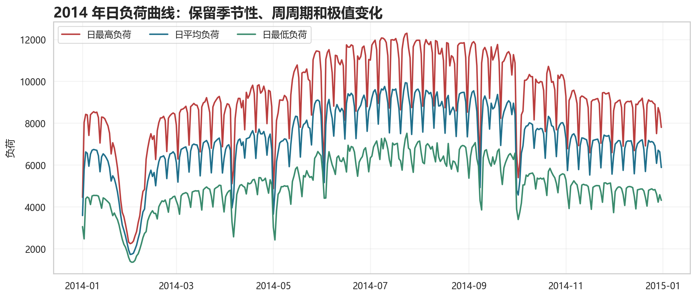

## 7. 核心代码：滞后与滚动特征

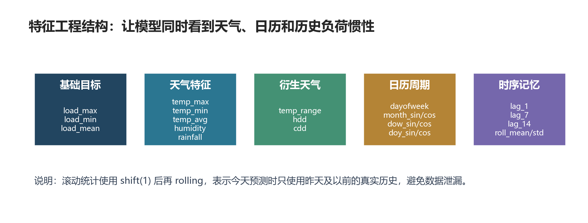


```python
def make_target_features(df: pd.DataFrame, target: str) -> tuple[pd.DataFrame, list[str]]:
    out = df.copy()
    lag_features: list[str] = []

    # 负荷序列有强惯性和周周期：昨天、上周同日、两周前同日通常是强预测信号。
    # 每个目标单独构造滞后项，避免用“日均负荷”的历史去预测“日最高/最低”时混淆目标。
    for lag in [1, 7, 14]:
        col = f"{target}_lag_{lag}"
        out[col] = out[target].shift(lag)
        lag_features.append(col)

    # 滚动均值/标准差描述近期负荷水平和波动程度，是短期预测里很实用的平滑特征。
    for win in [7, 14]:
        mean_col = f"{target}_roll_mean_{win}"
        std_col = f"{target}_roll_std_{win}"
        out[mean_col] = out[target].shift(1).rolling(win).mean()
        out[std_col] = out[target].shift(1).rolling(win).std()
        lag_features.extend([mean_col, std_col])
    return out, MODEL_WEATHER + CALENDAR_FEATURES + lag_features
```

## 8. 特征值演示与参考权重

特征名由代码自动生成，不是手工编表：

- `MODEL_WEATHER`：天气原始特征 + 天气衍生变量
- `CALENDAR_FEATURES`：日历周期变量
- `lag_features`：滞后与滚动窗口变量

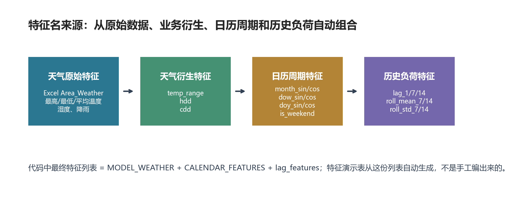

示例值来自 2015-01-10，这是预测窗口前最后一条完整历史样本。参考权重使用单变量 Pearson 相关系数的绝对值归一化得到，只表示数据处理阶段的解释性排序。

| 目标变量 | 特征名 | 中文含义 | 示例日期 | 示例值 | 参考权重(%) | 相关方向 |
| --- | --- | --- | --- | --- | --- | --- |
| 日平均负荷 | load_mean_lag_1 | 日平均负荷前 1 天滞后值 | 2015-01-10 | 7086.0616 | 9.21 | 正相关 |
| 日平均负荷 | load_mean_roll_mean_7 | 日平均负荷过去 7 天滚动均值 | 2015-01-10 | 6693.0303 | 8.63 | 正相关 |
| 日平均负荷 | load_mean_roll_mean_14 | 日平均负荷过去 14 天滚动均值 | 2015-01-10 | 6235.9598 | 8.15 | 正相关 |
| 日平均负荷 | load_mean_lag_7 | 日平均负荷前 7 天滞后值 | 2015-01-10 | 5934.0155 | 7.76 | 正相关 |
| 日平均负荷 | temp_avg | 平均温度 | 2015-01-10 | 15.4 | 6.68 | 正相关 |
| 日平均负荷 | temp_min | 最低温度 | 2015-01-10 | 12.0 | 6.67 | 正相关 |
| 日平均负荷 | load_mean_lag_14 | 日平均负荷前 14 天滞后值 | 2015-01-10 | 6912.8767 | 6.65 | 正相关 |
| 日平均负荷 | doy_cos | 年内日周期余弦 | 2015-01-10 | 0.9852 | 6.51 | 负相关 |
| 日平均负荷 | cdd | 制冷度日 | 2015-01-10 | 0.0 | 6.4 | 正相关 |
| 日平均负荷 | temp_max | 最高温度 | 2015-01-10 | 19.9 | 6.23 | 正相关 |
| 日平均负荷 | month_cos | 月份周期余弦 | 2015-01-10 | 0.866 | 5.33 | 负相关 |
| 日平均负荷 | month_sin | 月份周期正弦 | 2015-01-10 | 0.5 | 5.11 | 负相关 |
| 日平均负荷 | hdd | 供热度日 | 2015-01-10 | 2.6 | 3.9 | 负相关 |
| 日平均负荷 | doy_sin | 年内日周期正弦 | 2015-01-10 | 0.1713 | 3.58 | 负相关 |
| 日平均负荷 | is_weekend | 是否周末 | 2015-01-10 | 1.0 | 2.12 | 负相关 |
| 日平均负荷 | dow_sin | 星期周期正弦 | 2015-01-10 | -0.9749 | 1.62 | 正相关 |
| 日平均负荷 | dow_cos | 星期周期余弦 | 2015-01-10 | -0.2225 | 1.41 | 负相关 |
| 日平均负荷 | humidity | 相对湿度 | 2015-01-10 | 54.0 | 1.23 | 正相关 |
| 日平均负荷 | load_mean_roll_std_7 | 日平均负荷过去 7 天滚动标准差 | 2015-01-10 | 501.7546 | 1.0 | 正相关 |
| 日平均负荷 | load_mean_roll_std_14 | 日平均负荷过去 14 天滚动标准差 | 2015-01-10 | 1033.255 | 0.86 | 负相关 |
| 日平均负荷 | rainfall | 降雨量 | 2015-01-10 | 0.0 | 0.76 | 正相关 |
| 日平均负荷 | temp_range | 日温差 | 2015-01-10 | 7.9 | 0.18 | 负相关 |
| 日最低负荷 | load_min_lag_1 | 日最低负荷前 1 天滞后值 | 2015-01-10 | 4841.274 | 9.47 | 正相关 |
| 日最低负荷 | load_min_roll_mean_7 | 日最低负荷过去 7 天滚动均值 | 2015-01-10 | 4461.5954 | 8.79 | 正相关 |
| 日最低负荷 | load_min_roll_mean_14 | 日最低负荷过去 14 天滚动均值 | 2015-01-10 | 4210.357 | 8.41 | 正相关 |
| 日最低负荷 | load_min_lag_7 | 日最低负荷前 7 天滞后值 | 2015-01-10 | 3632.8675 | 7.75 | 正相关 |
| 日最低负荷 | temp_min | 最低温度 | 2015-01-10 | 12.0 | 7.07 | 正相关 |
| 日最低负荷 | temp_avg | 平均温度 | 2015-01-10 | 15.4 | 7.07 | 正相关 |
| 日最低负荷 | cdd | 制冷度日 | 2015-01-10 | 0.0 | 6.92 | 正相关 |
| 日最低负荷 | load_min_lag_14 | 日最低负荷前 14 天滞后值 | 2015-01-10 | 4826.8938 | 6.9 | 正相关 |
| 日最低负荷 | doy_cos | 年内日周期余弦 | 2015-01-10 | 0.9852 | 6.86 | 负相关 |
| 日最低负荷 | temp_max | 最高温度 | 2015-01-10 | 19.9 | 6.59 | 正相关 |
| 日最低负荷 | month_cos | 月份周期余弦 | 2015-01-10 | 0.866 | 5.61 | 负相关 |
| 日最低负荷 | month_sin | 月份周期正弦 | 2015-01-10 | 0.5 | 5.35 | 负相关 |
| 日最低负荷 | hdd | 供热度日 | 2015-01-10 | 2.6 | 4.1 | 负相关 |
| 日最低负荷 | doy_sin | 年内日周期正弦 | 2015-01-10 | 0.1713 | 3.72 | 负相关 |
| 日最低负荷 | dow_cos | 星期周期余弦 | 2015-01-10 | -0.2225 | 1.68 | 负相关 |
| 日最低负荷 | humidity | 相对湿度 | 2015-01-10 | 54.0 | 1.34 | 正相关 |
| 日最低负荷 | rainfall | 降雨量 | 2015-01-10 | 0.0 | 0.88 | 正相关 |
| 日最低负荷 | load_min_roll_std_7 | 日最低负荷过去 7 天滚动标准差 | 2015-01-10 | 458.4153 | 0.86 | 正相关 |
| 日最低负荷 | dow_sin | 星期周期正弦 | 2015-01-10 | -0.9749 | 0.36 | 正相关 |
| 日最低负荷 | temp_range | 日温差 | 2015-01-10 | 7.9 | 0.2 | 负相关 |
| 日最低负荷 | load_min_roll_std_14 | 日最低负荷过去 14 天滚动标准差 | 2015-01-10 | 780.4651 | 0.07 | 负相关 |
| 日最低负荷 | is_weekend | 是否周末 | 2015-01-10 | 1.0 | 0.02 | 负相关 |
| 日最高负荷 | load_max_lag_1 | 日最高负荷前 1 天滞后值 | 2015-01-10 | 9000.5603 | 8.49 | 正相关 |
| 日最高负荷 | load_max_roll_mean_7 | 日最高负荷过去 7 天滚动均值 | 2015-01-10 | 8575.2658 | 8.41 | 正相关 |
| 日最高负荷 | load_max_lag_7 | 日最高负荷前 7 天滞后值 | 2015-01-10 | 7789.1912 | 7.93 | 正相关 |
| 日最高负荷 | load_max_roll_mean_14 | 日最高负荷过去 14 天滚动均值 | 2015-01-10 | 8024.678 | 7.93 | 正相关 |
| 日最高负荷 | load_max_lag_14 | 日最高负荷前 14 天滞后值 | 2015-01-10 | 8899.3291 | 6.8 | 正相关 |
| 日最高负荷 | temp_min | 最低温度 | 2015-01-10 | 12.0 | 6.47 | 正相关 |
| 日最高负荷 | temp_avg | 平均温度 | 2015-01-10 | 15.4 | 6.47 | 正相关 |
| 日最高负荷 | doy_cos | 年内日周期余弦 | 2015-01-10 | 0.9852 | 6.33 | 负相关 |
| 日最高负荷 | temp_max | 最高温度 | 2015-01-10 | 19.9 | 6.03 | 正相关 |
| 日最高负荷 | cdd | 制冷度日 | 2015-01-10 | 0.0 | 6.01 | 正相关 |
| 日最高负荷 | month_cos | 月份周期余弦 | 2015-01-10 | 0.866 | 5.2 | 负相关 |
| 日最高负荷 | month_sin | 月份周期正弦 | 2015-01-10 | 0.5 | 4.96 | 负相关 |
| 日最高负荷 | hdd | 供热度日 | 2015-01-10 | 2.6 | 3.8 | 负相关 |
| 日最高负荷 | doy_sin | 年内日周期正弦 | 2015-01-10 | 0.1713 | 3.47 | 负相关 |
| 日最高负荷 | is_weekend | 是否周末 | 2015-01-10 | 1.0 | 2.79 | 负相关 |
| 日最高负荷 | load_max_roll_std_7 | 日最高负荷过去 7 天滚动标准差 | 2015-01-10 | 566.0138 | 2.75 | 正相关 |
| 日最高负荷 | dow_sin | 星期周期正弦 | 2015-01-10 | -0.9749 | 2.01 | 正相关 |
| 日最高负荷 | dow_cos | 星期周期余弦 | 2015-01-10 | -0.2225 | 1.36 | 负相关 |
| 日最高负荷 | humidity | 相对湿度 | 2015-01-10 | 54.0 | 1.25 | 正相关 |
| 日最高负荷 | rainfall | 降雨量 | 2015-01-10 | 0.0 | 0.79 | 正相关 |
| 日最高负荷 | load_max_roll_std_14 | 日最高负荷过去 14 天滚动标准差 | 2015-01-10 | 1286.2136 | 0.57 | 正相关 |
| 日最高负荷 | temp_range | 日温差 | 2015-01-10 | 7.9 | 0.2 | 负相关 |


```python
def compute_feature_weights(daily: pd.DataFrame) -> pd.DataFrame:
"""计算数据处理阶段的特征参考权重，对应 HTML 第 11 节。"""
rows: list[dict[str, object]] = []
for target, target_cn in p2.TARGETS.items():
    # 复用主项目里的 make_target_features，保证汇报展示的特征和真实建模特征一致。
    feature_df, features = p2.make_target_features(daily, target)
    feature_df = feature_df[feature_df["date"] <= pd.Timestamp("2015-01-10")]
    # 滞后/滚动特征前几天会产生 NaN，计算相关性前要去掉。
    feature_df = feature_df.dropna(subset=[target, *features])
    scores: list[tuple[str, float, float]] = []
    for feature in features:
        # 这里用“单变量 Pearson 相关系数”做解释性排序，不代表最终模型参数。
        corr = feature_df[[target, feature]].corr().iloc[0, 1]
        if pd.isna(corr) or np.isinf(corr):
            corr = 0.0
        # 权重看强弱，所以取绝对值；正负方向单独保存在“相关方向”里。
        scores.append((feature, float(corr), abs(float(corr))))
    # 把每个目标变量下所有特征的相关性绝对值归一化成百分比。
    total = sum(score for _, _, score in scores) or 1.0
    for feature, corr, score in scores:
        rows.append(
            {
                "目标变量": target_cn,
                "特征名": feature,
                "中文含义": feature_label(feature),
                "相关方向": "正相关" if corr >= 0 else "负相关",
                "相关系数": round(corr, 4),
                "参考权重(%)": round(score / total * 100, 2),
            }
        )
return pd.DataFrame(rows).sort_values(["目标变量", "参考权重(%)"], ascending=[True, False])


    def build_feature_dictionary(daily: pd.DataFrame, weights: pd.DataFrame) -> pd.DataFrame:
"""生成“每个特征的示例值”表，方便汇报时解释特征到底是什么。"""
rows: list[dict[str, object]] = []
for target, target_cn in p2.TARGETS.items():
    feature_df, features = p2.make_target_features(daily, target)
    feature_df = feature_df[feature_df["date"] <= pd.Timestamp("2015-01-10")]
    # 取历史期最后一条完整样本作为演示样本，日期接近预测起点，最容易讲清楚。
    sample = feature_df.dropna(subset=features).tail(1).iloc[0]
    weight_part = weights[weights["目标变量"] == target_cn].set_index("特征名")
    for feature in features:
        rows.append(
            {
                "目标变量": target_cn,
                "特征名": feature,
                "中文含义": feature_label(feature),
                "示例日期": sample["date"].strftime("%Y-%m-%d"),
                "示例值": round(float(sample[feature]), 4),
                "参考权重(%)": float(weight_part.loc[feature, "参考权重(%)"]),
                "相关方向": str(weight_part.loc[feature, "相关方向"]),
            }
        )
return pd.DataFrame(rows).sort_values(["目标变量", "参考权重(%)"], ascending=[True, False])
```

## 9. 汇报结论

处理后的数据表已经把原始 15 分钟负荷转换成项目要求的日最高、日最低、日平均三个预测目标，并补充了天气、日历周期、极端事件标记、历史负荷特征和特征参考权重。第二次汇报即可进入算法模型训练与对比。
